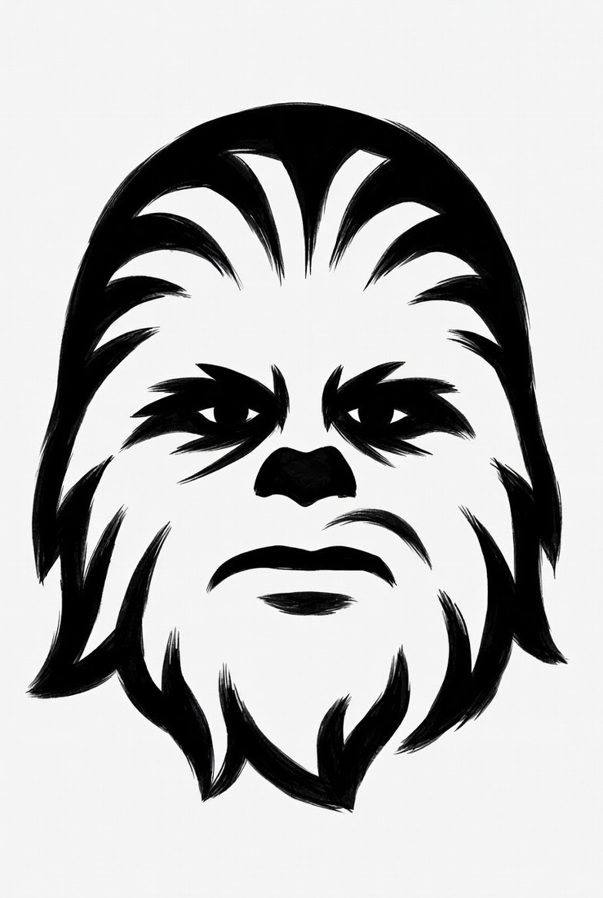

<p align="center">
  
</p>

<h1 align="center">Chewy</h1>

<p align="center">
  A terminal UI for AI image generation with Stable Diffusion, FLUX, DALL-E, Imagen, and more.
</p>

<p align="center">
  Built with the <a href="https://github.com/nicholasgasior/ruby-bubbletea">Charm Ruby</a> ecosystem (bubbletea, lipgloss, bubbles). Supports local generation via <a href="https://github.com/leejet/stable-diffusion.cpp">stable-diffusion.cpp</a> and 5 cloud providers.
</p>

<p align="center">
  <a href="https://chewytui.xyz">Website</a> &bull; <a href="https://chewytui.xyz/docs.html">Documentation</a> &bull; <a href="https://github.com/Holy-Coders/chewy/issues">Issues</a>
</p>

---

## Install

```bash
brew install Holy-Coders/chewy/chewy
```

This installs both `chewy` and `sd` (the stable-diffusion.cpp inference engine with Metal GPU acceleration).

### Manual install

Requirements: Ruby 4.0+, [stable-diffusion.cpp](https://github.com/leejet/stable-diffusion.cpp)

```bash
git clone https://github.com/Holy-Coders/chewy.git
cd chewy
bundle install
ruby chewy.rb
```

Set `SD_BIN` to point to your `sd` binary if it's not on your PATH.

## Usage

```bash
chewy              # Launch the TUI
chewy list          # List all generated images
chewy delete FILE   # Delete a generated image
chewy help          # Show help
```

### Providers

Chewy supports 6 image generation backends. Press `^y` to switch providers.

| Provider | Models | Type |
|----------|--------|------|
| **Local (sd.cpp)** | SD 1.x/2.x/3.5, SDXL, FLUX (.gguf/.safetensors/.ckpt) | Local |
| **OpenAI** | GPT Image 1, DALL-E 3, DALL-E 2 | API |
| **Gemini** | Imagen 3, Imagen 3 Fast, Gemini 2.0 Flash | API |
| **HuggingFace** | FLUX.1 Schnell/Dev, SDXL, SD 3.5 Large, HiDream | API |
| **OpenAI-Compatible** | Any model via custom endpoint | API |

API keys are entered in-app (stored securely with chmod 600) or via environment variables (`OPENAI_API_KEY`, `GEMINI_API_KEY`, `HUGGINGFACE_API_KEY`).

### Keyboard shortcuts

| Key | Action |
|-----|--------|
| `tab` | Cycle focus between prompt, negative prompt, and params |
| `enter` | Generate image (when in prompt/negative) |
| `up/down` | Cycle through prompt history (in prompt field) |
| `^y` | Switch provider |
| `^n` | Open model picker |
| `^d` | Download models (HuggingFace / CivitAI) |
| `^t` | Theme picker (10 built-in + custom themes) |
| `^a` | Gallery |
| `^g` | Generation history |
| `^b` | Browse for init image (img2img) |
| `^v` | Paste image from clipboard (img2img) |
| `^u` | Clear init image |
| `^l` | LoRA selection |
| `^p` | Presets |
| `^e` | Open last image in viewer |
| `^f` | Fullscreen image preview |
| `^x` | Cancel generation |
| `^w` | Clear prompt and image (start fresh) |
| `^r` | Randomize seed |
| `alt+e` | AI enhance prompt |
| `alt+n` | AI generate negative prompt |
| `alt+r` | AI random creative prompt |
| `F1` | Help overlay (all shortcuts) |
| `^q` | Quit |

### Models

Place `.gguf`, `.safetensors`, or `.ckpt` model files in `~/.config/chewy/models` (or set `CHEWY_MODELS_DIR`). Full filenames are shown in the model picker.

Chewy also scans for models from:
- **DiffusionBee** (`~/.diffusionbee`)
- **Draw Things** (`~/Library/Containers/com.liuliu.draw-things/Data/Documents/Models`)

Press `^d` inside chewy to browse recommended starter models or search HuggingFace and CivitAI. Curated picks include SD 1.5, SD 3.5 Medium, SDXL Turbo, DreamShaper, and FLUX.1 Schnell.

### FLUX models

FLUX models require companion files (clip_l, t5xxl, vae). Chewy will automatically download these when you first try to generate with a FLUX model. You'll need a [HuggingFace token](https://huggingface.co/settings/tokens) with read access.

### LoRAs

Place LoRA `.safetensors` files in `~/.config/chewy/loras` (or set `CHEWY_LORA_DIR`). Press `^l` to open the LoRA selector where you can toggle LoRAs on/off, adjust weights (0.0-2.0), and download new ones.

Press `d` in the LoRA panel to browse recommended LoRAs or search HuggingFace and CivitAI. Recommended picks include Detail Tweaker, LCM LoRA (for fast generation), Pixel Art, and Papercut styles. Chewy warns if a LoRA doesn't match your model's architecture (e.g. SDXL LoRA on SD 1.5 model).

### Inpainting

Inpainting lets you selectively regenerate parts of an image while preserving others (e.g. change the background but keep the face). Set an init image (`^b`), then in the params panel navigate to `Mask` and:

- Press `g` to auto-generate a center-preserve mask (keeps the face, regenerates the rest)
- Press `p` to open the **mask painter** — click to paint which areas to regenerate
- Press `enter` to browse for a custom mask image

White pixels in the mask = regenerate, black = keep. The "Inpaint - Face Preserve" preset configures everything automatically.

### Themes

10 built-in color themes: Midnight (default), Dracula, Catppuccin, Tokyo Night, Gruvbox, Nord, Rose Pine, Solarized, Horizon, and Light. Press `^t` to switch.

**Custom themes:** Drop a YAML file in `~/.config/chewy/themes/` with 13 color keys and it appears in the theme picker. Example `~/.config/chewy/themes/cyberpunk.yml`:

```yaml
primary: "#00FF41"
secondary: "#008F11"
accent: "#FF0090"
success: "#00FF41"
warning: "#FFD300"
error: "#FF0000"
text: "#E0E0E0"
text_dim: "#808080"
text_muted: "#505050"
surface: "#0D0D0D"
border_dim: "#333333"
border_focus: "#00FF41"
bar_text: "#000000"
```

CLI commands (help, list, etc.) also use your selected theme colors. An animated pixel-art splash screen greets you on startup.

### Presets

Press `^p` to open the preset picker. Built-in presets include fast, quality, portrait, flux-fast, and flux-quality configurations. Save your own custom presets with your preferred settings.

### AI Prompt Enhancement

Chewy can enhance your prompts, generate negative prompts, and create random creative prompts using a local or cloud LLM.

- `alt+e` — Enhance your prompt (adds detail, lighting, composition, quality tags)
- `alt+n` — Auto-generate a negative prompt from your positive prompt
- `alt+r` — Generate a random creative prompt from scratch
- Click the **✨ Enhance** / **✨ Generate** button in the prompt box

**LLM priority:** Local (ollama/LM Studio) → OpenAI → Gemini → rule-based fallback. For the best local experience: `brew install ollama && ollama pull llama3.2:3b`.

### Prompt History

Chewy remembers your prompt history across sessions. Press `up/down` in the prompt field to cycle through previous prompts. History is loaded from your generation metadata on disk, so past prompts are available even in a fresh session.

### Samplers & Schedulers

14 samplers (euler, euler_a, heun, dpm2, dpm++2s_a, dpm++2m, dpm++2mv2, ipndm, ipndm_v, lcm, ddim_trailing, tcd, res_multistep, res_2s) and 9 schedulers (discrete, karras, exponential, ays, gits, sgm_uniform, simple, smoothstep, kl_optimal). Configurable thread count for local generation.

### img2img

Press `^b` to browse for an input image, or `^v` to paste from clipboard. Adjust the `strength` parameter (0.0-1.0) to control how much the output differs from the input. Use `^u` to clear and go back to txt2img.

### Configuration

Config is stored at `~/.config/chewy/config.yml`. Presets are stored at `~/.config/chewy/presets.yml`.

| Env var | Description |
|---------|-------------|
| `SD_BIN` | Path to the `sd` binary |
| `CHEWY_MODELS_DIR` | Model directory (default: `~/.config/chewy/models`) |
| `CHEWY_OUTPUT_DIR` | Output directory (default: `./outputs`) |
| `CHEWY_LORA_DIR` | LoRA directory (default: `~/.config/chewy/loras`) |

## Contributing

### Setup

```bash
git clone https://github.com/Holy-Coders/chewy.git
cd chewy
bundle install
```

You'll need [stable-diffusion.cpp](https://github.com/leejet/stable-diffusion.cpp) built and on your PATH (or set `SD_BIN`):

```bash
git clone --recursive https://github.com/leejet/stable-diffusion.cpp
cd stable-diffusion.cpp
mkdir build && cd build
cmake .. -DSD_METAL=ON    # macOS with Metal GPU
cmake --build . --config Release
cp bin/sd-cli /usr/local/bin/sd
```

### Project structure

This is a single-file app:

- `chewy.rb` — the entire TUI application
- `Gemfile` / `Gemfile.lock` — Ruby dependencies
- `VERSION` — semver, read at runtime and used by CI for releases
- `Formula/` — Homebrew formulas (sd-cpp and chewy)
- `docs/` — Landing page and documentation (GitHub Pages)
- `logo.jpeg` — the logo

### Dependencies

| Gem | Purpose |
|-----|---------|
| [bubbletea](https://rubygems.org/gems/bubbletea) | Elm Architecture TUI framework |
| [lipgloss](https://rubygems.org/gems/lipgloss) | Terminal styling and layout |
| [bubbles](https://rubygems.org/gems/bubbles) | TUI components (list, text input, spinner, progress) |
| [chunky_png](https://rubygems.org/gems/chunky_png) | PNG reading for terminal image rendering |

### Making changes

1. Fork the repo
2. Create a branch (`git checkout -b my-feature`)
3. Make your changes to `chewy.rb`
4. Test locally with `ruby chewy.rb`
5. Open a PR

### Releasing

Bump the version in `VERSION` and push to `main`. CI will automatically:
1. Create a GitHub release
2. Update the Homebrew formula with the new sha256

## License

[MIT](LICENSE) - Copyright (c) 2026 Holy Coders
